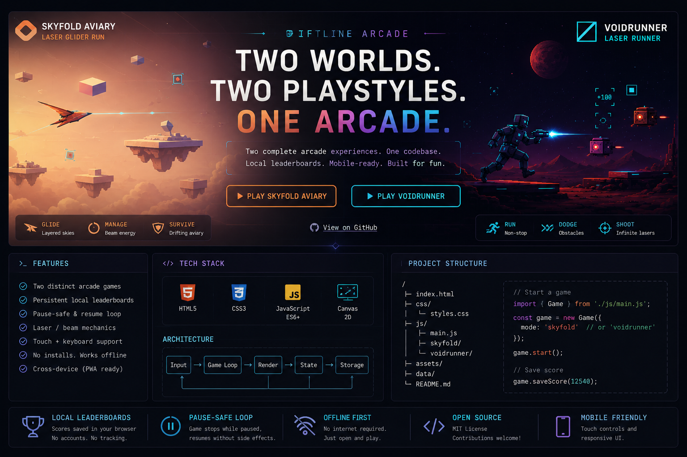
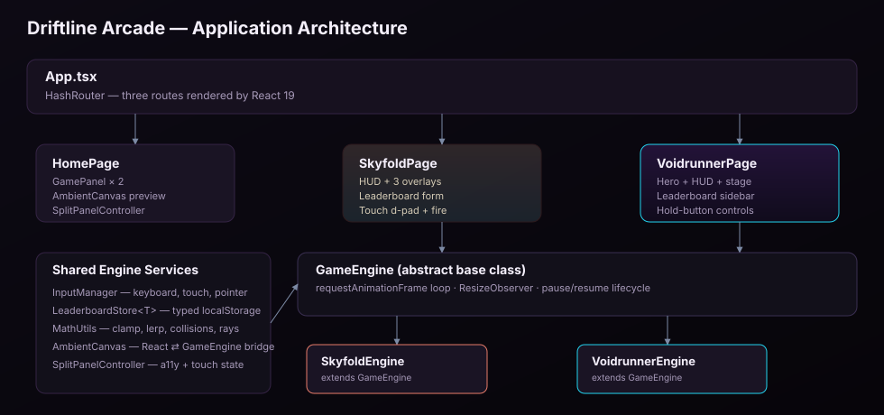
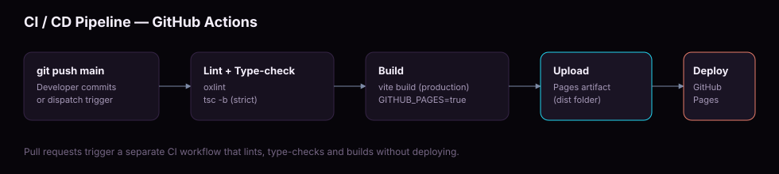

<div align="center">



# Driftline Arcade

**Two original browser arcade games, one TypeScript and React codebase.**

[](#deployment)
[](https://react.dev)
[](https://www.typescriptlang.org)
[](https://vite.dev)
[](LICENSE)

[Live demo](#deployment) &middot; [Skyfold Aviary](#skyfold-aviary) &middot; [Voidrunner](#voidrunner) &middot; [Architecture](#architecture) &middot; [Getting started](#getting-started)

</div>

---

## Overview

Driftline Arcade is a single-page arcade built entirely in TypeScript with React 19. It hosts two
canvas based games behind one router, one design system, and one continuous deployment pipeline:

| Game | Genre | Signature mechanic |
| --- | --- | --- |
| **Skyfold Aviary** | Cozy survival flight | Charge based laser beam, drifting iso terraces, repair pickups |
| **Voidrunner** | Laser survival runner | Infinite ammo laser, jump and slide timing, Martian horizon |

This repository is a full migration of an earlier vanilla HTML, CSS and JavaScript arcade into a
typed, component based, object oriented architecture, along with new features, accessibility
passes, and a production ready GitHub Actions release pipeline.

---

## Table of contents

1. [Architecture](#architecture)
2. [Object oriented engine design](#object-oriented-engine-design)
3. [Skyfold Aviary](#skyfold-aviary)
4. [Voidrunner](#voidrunner)
5. [What changed in the migration](#what-changed-in-the-migration)
6. [Project structure](#project-structure)
7. [Getting started](#getting-started)
8. [Available scripts](#available-scripts)
9. [Deployment](#deployment)
10. [Accessibility](#accessibility)
11. [Browser support](#browser-support)
12. [Contributing](#contributing)
13. [License](#license)

---

## Architecture

The application is a single Vite built React tree. Routing, presentation, and simulation are kept
in separate layers so each game's canvas simulation can evolve independently of its HUD.

<div align="center">
  
</div>

- **`App.tsx`** mounts a `HashRouter` with three routes: the landing page and each game. Hash based
  routing means the built site works as static files on GitHub Pages with no server rewrite rules.
- **Page components** (`HomePage`, `SkyfoldPage`, `VoidrunnerPage`) own React state for HUD values,
  overlays, and the leaderboard. They never touch the canvas pixel buffer directly.
- **Engine classes** own the simulation: entity state, physics, collisions, and rendering. They
  report state outward through typed callbacks so the DOM stays accessible and screen reader
  friendly while the canvas stays purely visual.

## Object oriented engine design

Every interactive or ambient canvas in the app extends the same abstract base class, so the
render loop, resize handling, and pause and resume lifecycle are written once and inherited
everywhere.

```
GameEngine                       (abstract: raf loop, resize, pause/resume)
├── SkyfoldEngine                (playable Skyfold Aviary simulation)
├── VoidrunnerEngine             (playable Voidrunner simulation)
├── SkyfoldAmbientScene          (decorative landing page preview)
└── VoidrunnerAmbientScene       (decorative landing page preview)
```

Supporting services are composed into each engine rather than duplicated:

- **`InputManager`** centralizes keyboard, pointer, and touch state with automatic listener
  cleanup on unmount.
- **`LeaderboardStore<T>`** is a generic, type safe wrapper around `localStorage` used by both
  games with their own storage key and sort order.
- **`MathUtils`** holds pure functions for clamping, interpolation, circle and segment collision,
  and ray versus circle intersection used by the laser weapons in both games.

This keeps each `Engine` class focused entirely on gameplay rules while cross cutting concerns
stay in one tested place.

---

## Skyfold Aviary

<table>
<tr>
<td width="60%">

A laser glider drifts between floating iso terraces at golden hour. The pace is deliberately
unhurried until a monolith breaks formation.

- Charge based beam with a visible cooldown ring in the HUD
- Procedural terrace density that escalates with each layer
- Directional touch pad and a dedicated fire button for handheld play
- Local leaderboard tracking pilot name, best layer, score, and run time
- Mid flight repair pickups introduced from layer three onward
- Full keyboard, mouse aim, and touch support in a single input layer

</td>
<td width="40%">

**Controls**

| Input | Action |
| --- | --- |
| Arrow keys / WASD | Move glider |
| Mouse | Aim toward cursor |
| Space / Fire button | Charge and release beam |
| P / Escape | Pause |

</td>
</tr>
</table>

## Voidrunner

<table>
<tr>
<td width="60%">

VEGA sprints across Mars Sector 7 with one infinite charge laser and a tight run, jump, and slide
rhythm against rocks, crystals, drones, gates, and turrets.

- Infinite ammo laser for constant offensive pressure
- Jump, double jump, slide, and fast fall layered into readable sequences
- High contrast sci-fi HUD with live score, best score, and lives
- Persistent on device leaderboard with run count tracking
- Shield and extra life pickups placed along the route

</td>
<td width="40%">

**Controls**

| Input | Action |
| --- | --- |
| Space / Up | Jump (double jump available) |
| Down | Slide or fast fall |
| F / Z | Fire laser |
| P / Escape | Pause |

</td>
</tr>
</table>

---

## What changed in the migration

The original project was three static HTML pages with inline `<script>` tags and duplicated CSS
resets. The rebuild is a single typed application with the following improvements:

- **Full TypeScript, strict mode.** Every entity, HUD payload, and engine callback has an explicit
  interface. `noUnusedLocals` and `noUnusedParameters` are enabled repository wide.
- **Object oriented simulation core.** A shared `GameEngine` base class replaced two independent,
  copy pasted `requestAnimationFrame` loops and two independent resize handlers.
- **Component based HUD.** HUD numbers, overlays, and leaderboard rows are now React state driven
  instead of direct `element.textContent` mutation, which removes an entire class of stale DOM bugs.
- **Scoped styling.** Each game's stylesheet is now a CSS module so class names such as `.overlay`
  or `.hud` cannot leak between routes, which was a real risk in the original global stylesheets.
- **Repeat safe input handling.** Keyboard repeat events no longer cause runaway pause toggles or
  duplicate jumps, an edge case the original inline scripts did not guard against.
- **Generic leaderboard persistence.** A single `LeaderboardStore<T>` class replaced two separate,
  slightly different `localStorage` read and write implementations.
- **Automated release pipeline.** A GitHub Actions workflow now lints, type-checks, builds, and
  deploys to GitHub Pages on every push to `main`, with a separate pull request workflow that
  verifies the build without deploying.
- **Accessibility pass.** Landing page panels are keyboard operable with `aria-expanded` state,
  touch only devices get an explicit tap to expand affordance instead of relying on `:hover`, and
  overlays use proper dialog roles.

---

## Project structure

```
driftline-arcade/
├── .github/workflows/        CI and GitHub Pages deployment workflows
├── docs/
│   ├── assets/                Banner image used in this README
│   └── diagrams/               Architecture and pipeline SVG diagrams
├── public/                    Static files copied as is into the build
├── src/
│   ├── engine/
│   │   ├── GameEngine.ts       Abstract render loop and lifecycle base class
│   │   ├── InputManager.ts     Keyboard, pointer, and touch input handling
│   │   ├── LeaderboardStore.ts Generic typed localStorage leaderboard
│   │   └── MathUtils.ts        Shared math and collision helpers
│   ├── components/
│   │   ├── GamePanel.tsx       Landing page split-panel presentation
│   │   ├── SplitPanelController.ts
│   │   └── ambient/            Decorative landing page canvas scenes
│   ├── games/
│   │   ├── skyfold/            SkyfoldEngine, SkyfoldPage, styles, types
│   │   └── voidrunner/         VoidrunnerEngine, VoidrunnerPage, styles, types
│   ├── pages/                  HomePage and NotFoundPage
│   ├── styles/                 Landing page global stylesheet
│   ├── App.tsx                 Router composition root
│   └── main.tsx                React entry point
├── index.html
├── vite.config.ts
└── package.json
```

---

## Getting started

### Prerequisites

- Node.js 20 or later
- npm 10 or later

### Installation

```bash
git clone https://github.com/hassanireza/driftlineArcade.git
cd driftlineArcade
npm install
```

### Local development

```bash
npm run dev
```

Vite starts a dev server, by default at `http://localhost:5173`, with hot module reloading for
every component and engine class.

---

## Available scripts

| Script | Description |
| --- | --- |
| `npm run dev` | Start the Vite development server |
| `npm run build` | Type-check with `tsc -b`, then build a production bundle to `dist/` |
| `npm run build:pages` | Same as `build`, with the base path set for GitHub Pages |
| `npm run preview` | Serve the production build locally for a final check |
| `npm run lint` | Run `oxlint` across the project |

---

## Deployment

<div align="center">
  
</div>

Deployment is fully automated through `.github/workflows/deploy.yml`:

1. Push to `main` (or trigger the workflow manually).
2. GitHub Actions installs dependencies, runs `oxlint`, runs `tsc -b`, and builds the production
   bundle with `GITHUB_PAGES=true` so Vite emits the correct `/driftlineArcade/` base path.
3. The `dist/` folder is uploaded as a Pages artifact and deployed by `actions/deploy-pages`.

To enable it on your own fork or repository:

1. In the repository settings, open **Pages** and set the source to **GitHub Actions**.
2. Push to `main`. The **Deploy to GitHub Pages** workflow will run automatically.
3. If your repository name is not `driftline-arcade`, update the `base` value in
   `vite.config.ts` to match.

Every pull request also runs `.github/workflows/ci.yml`, which lints, type-checks, and builds the
project without deploying, so regressions are caught before merge.

---

## Accessibility

- All interactive overlays use `role="dialog"` with `aria-modal` and labelled headings.
- Landing page panels are reachable and operable by keyboard, with `Enter` and `Space` toggling
  expansion and visible focus styles.
- Touch only devices receive an explicit tap-to-expand affordance instead of relying solely on
  `:hover`, which does not fire reliably on touch hardware.
- Live regions (`aria-live="polite"`) wrap HUD values and leaderboard rows so score changes are
  announced without moving focus.

## Browser support

Driftline Arcade targets current versions of Chrome, Firefox, Safari, and Edge on desktop and
mobile. It uses `ResizeObserver`, the Canvas 2D API, and CSS `:has()` for the landing page hover
choreography, all of which are supported in current evergreen browsers.

---

## Contributing

1. Fork the repository and create a feature branch.
2. Run `npm install` and `npm run dev` to develop locally.
3. Run `npm run lint` and `npm run build` before opening a pull request.
4. Open a pull request against `main`. The CI workflow will validate your changes automatically.

## License

Released under the [MIT License](LICENSE).
